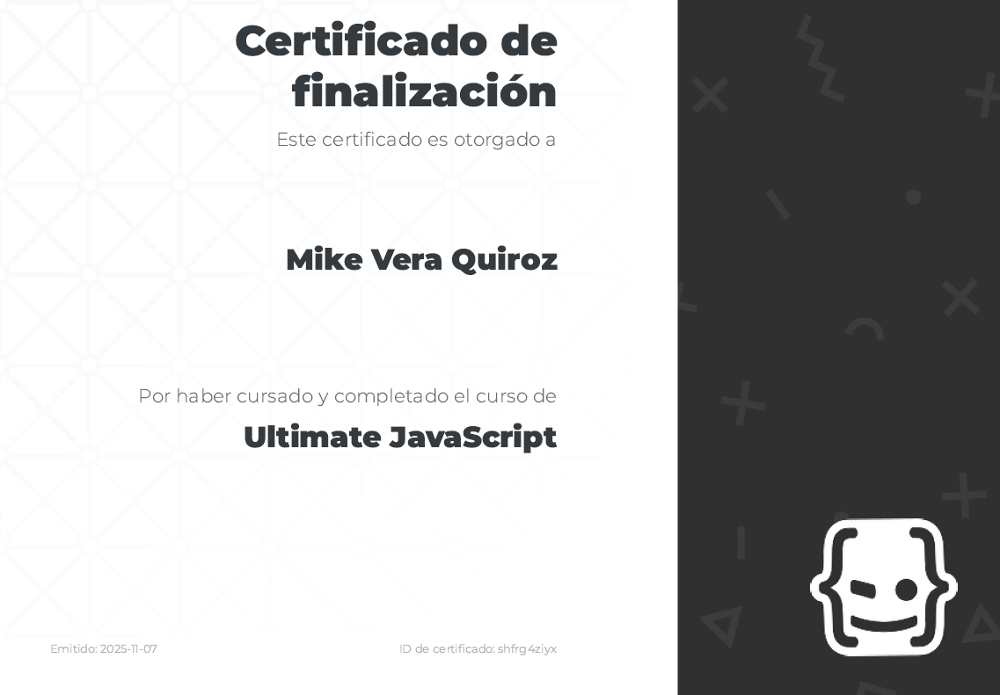

## JS Course with Nicolas Schurmann

```bash
# Academy
$ https://academia.holamundo.io/courses/ultimate-javascript
```

```bash
# My Certificate
$ https://academia.holamundo.io/certificates/shfrg4ziyx
```
[](https://academia.holamundo.io/certificates/shfrg4ziyx)
